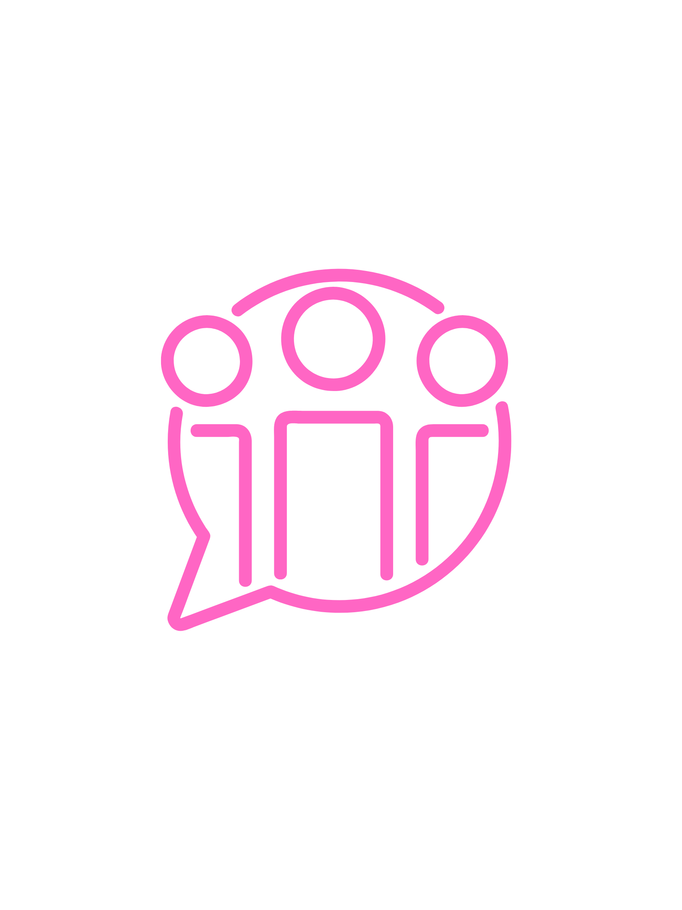
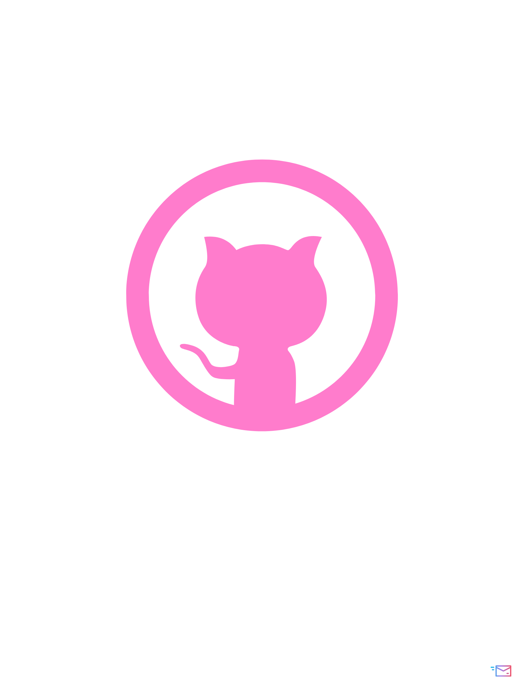
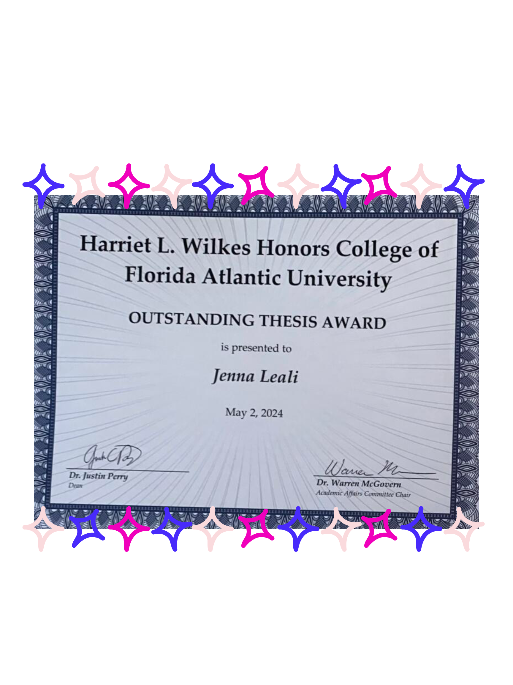
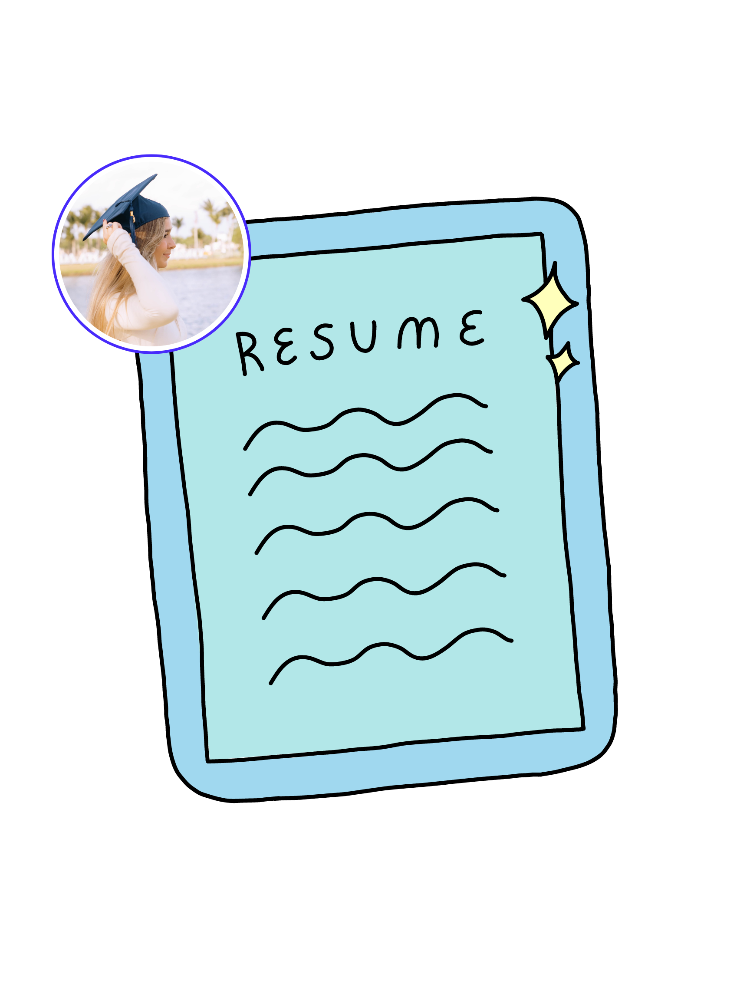
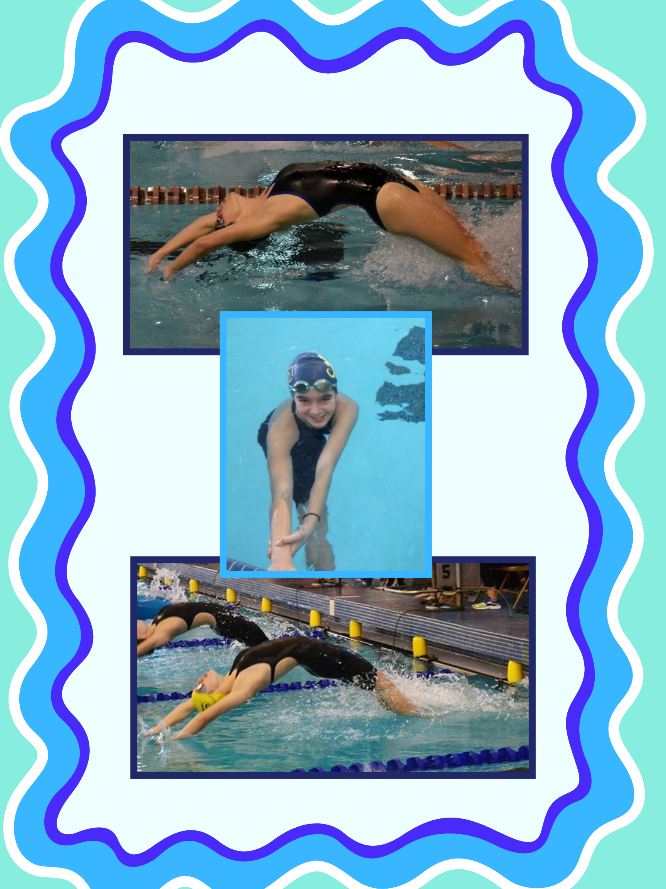
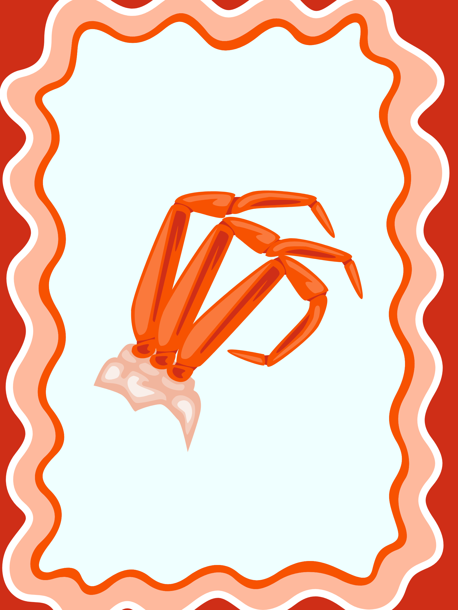

<!-- Navigation Bar -->

  

    <a href="#home" style="color: white; font-size: 18px; text-decoration: none; padding: 10px;">Home</a>
    <a href="#education" style="color: white; font-size: 18px; text-decoration: none; padding: 10px;">Education</a>
    <a href="#thesis" style="color: white; font-size: 18px; text-decoration: none; padding: 10px;">Thesis</a>
    <a href="#resume" style="color: white; font-size: 18px; text-decoration: none; padding: 10px;">Resume</a>
    <a href="#fun-facts" style="color: white; font-size: 18px; text-decoration: none; padding: 10px;">Fun Facts</a>
    <a href="#contact" style="color: white; font-size: 18px; text-decoration: none; padding: 10px;">Contact</a>
  

<!-- Home Section with Cream and Pink Theme -->

  <!-- Row containing image and name -->
  

    
    
    <h1 style="font-family: 'Comic Sans MS', cursive, sans-serif; color: #FF69B4; font-size: 45px; text-align: center;">
      Jenna Leali
    </h1>
  

  <!-- Typing animation directly below name -->
  

    
    |
  

  <!-- Button under typing text -->
  <a href="https://github.com/JennaLeali" style="font-size: 18px; background-color: #FFB6C1; color: white; padding: 10px 15px; border-radius: 5px; text-decoration: none; margin-bottom: 20px;">
    View project on GitHub
  </a>

  <!-- Project Cards Section arranged horizontally -->
  

    <!-- Project 1 -->
    

      <h3 style="font-family: 'Comic Sans MS', sans-serif; font-size: 20px; color: #FF69B4;">Project 1</h3>
      
Data analysis on customer behavior patterns.

    

    <!-- Project 2 -->
    

      <h3 style="font-family: 'Comic Sans MS', sans-serif; font-size: 20px; color: #FF69B4;">Project 2</h3>
      
Machine learning model predicting stock prices.

    

    <!-- Project 3 -->
    

      <h3 style="font-family: 'Comic Sans MS', sans-serif; font-size: 20px; color: #FF69B4;">Project 3</h3>
      
Natural language processing for sentiment analysis.

    

  

  <!-- CSS for Hover Effects -->
  

<!-- JavaScript for Typing Effect -->

---

<!-- Contact Section with Animated Icons and Subtle Background Animation -->

  <h2 style="font-family: 'Comic Sans MS', cursive, sans-serif; color: #FF69B4; font-size: 45px; text-align: center; margin-bottom: 40px;">
    Contact Information
  </h2>

  

    
    <!-- Email with Icon -->
    

      <a href="mailto:jallureleali@gmail.com" style="font-size: 20px; background-color: #FFD7D7; color: white; padding: 15px 30px; border-radius: 5px; text-decoration: none; display: flex; align-items: center; gap: 10px; transition: background-color 0.3s ease, transform 0.3s ease;">
         Click here to email me
      </a>
    

    <!-- LinkedIn with Icon -->
    

      <a href="https://www.linkedin.com/in/jennaleali/" target="_blank" style="font-size: 20px; background-color: #FFD7D7; color: white; padding: 15px 30px; border-radius: 5px; text-decoration: none; display: flex; align-items: center; gap: 10px; transition: background-color 0.3s ease, transform 0.3s ease;">
         Click here to see my LinkedIn
      </a>
    

    <!-- GitHub with Icon -->
    

      <a href="https://github.com/JennaLeali" target="_blank" style="font-size: 20px; background-color: #FFD7D7; color: white; padding: 15px 30px; border-radius: 5px; text-decoration: none; display: flex; align-items: center; gap: 10px; transition: background-color 0.3s ease, transform 0.3s ease;">
         Click here to visit my GitHub
      </a>
    

  
  

<!-- CSS for Hover Effects and Background Animation -->

---

  <h2 style="text-align: center; font-family: 'Comic Sans MS', cursive, sans-serif; color: #FF69B4;">Education</h2>
  
  

    
    <!-- FAU Logo -->
    

      
    

    
    <!-- Education Details -->
    

      <h3 style="color: #FF69B4; margin-bottom: 10px;">
        Master of Science in Data Science and Analytics, Florida Atlantic University
      </h3>
      
<a href="https://www.fau.edu/engineering/eecs/graduate/ms/data-science-and-analytics/courses/" target="_blank" style="color: #FF69B4;">Link to Degree Requirements</a>

      
Minor in Artificial Intelligence - <a href="https://www.fau.edu/engineering/eecs/undergraduate/minors/artificial-intelligence/" target="_blank" style="color: #FF69B4;">Link to Minor Details</a>

      
Big Data Analytics Certificate - <a href="https://www.fau.edu/engineering/eecs/graduate/certificates/big-data/" target="_blank" style="color: #FF69B4;">Link to Certificate Details</a>

      
<strong>(Expected graduation: Dec 2024)</strong>

      
      <h3 style="color: #FF69B4; margin-top: 30px; margin-bottom: 10px;">
        Bachelor of Science in Data Analytics, Florida Atlantic University Harriet L. Wilkes Honors College
      </h3>
      
<a href="https://www.fau.edu/honors/academics/majors/data-analytics/" target="_blank" style="color: #FF69B4;">Link to Degree Requirements</a>

      
Minor in Economics - <a href="https://www.fau.edu/honors/academics/majors/economics/" target="_blank" style="color: #FF69B4;">Link to Minor Details</a>

      
<strong>Graduated: 2024</strong>

    

  
  

  

---

  <h2 style="font-family: 'Comic Sans MS', cursive, sans-serif; color: #FF69B4; font-size: 40px; margin-bottom: 20px;">
    Read My Undergraduate Thesis
  </h2>

  

    I completed my undergraduate thesis on data science and analytics at Florida Atlantic University. You can read it by clicking the button below:
  

  <!-- Make the image larger and reduce the margin -->
  

    
  

  
  <a href="assets/documents/final.pdf" target="_blank" style="font-size: 18px; background-color: #FF69B4; color: white; padding: 12px 25px; border-radius: 5px; text-decoration: none; display: inline-block; margin-top: 10px;">
    Click here to read my thesis
  </a>

  <!-- Cool button link to Medallion Award Recipients page -->
  

    <a href="https://www.fau.edu/honors/current-students/student-awards/medallion-award-recipients/" target="_blank" style="font-size: 18px; background-color: #FFB6C1; color: white; padding: 12px 25px; border-radius: 5px; text-decoration: none; display: inline-block;">
      Learn more about the Medallion Award Recipients
    </a>
  

---

<!-- Enhanced Resume Section with Rotating Border and Pulse Hover Effect -->

  <h2 style="font-family: 'Comic Sans MS', cursive, sans-serif; color: #FF69B4; font-size: 45px; text-align: center; margin-bottom: 40px;">
    Resume
  </h2>

  <!-- Centering Content -->
  

    
    <!-- Resume image link with Glow, Pulse, and Rotating Border Effects -->
    <a href="resume.pdf" target="_blank" style="position: relative; display: inline-block;">
      <!-- Rotating border container -->
      

      <!-- Image -->
      
    </a>
  
  

  <!-- Hover Effects, Rotating Border, and Pulse Animation -->
  

---

<!-- Horizontal Sliding Achievements Timeline Section -->

  <h2 style="font-family: 'Comic Sans MS', cursive, sans-serif; color: #FF69B4; font-size: 40px; margin-bottom: 20px;">
    Achievements Timeline
  </h2>

  <!-- Slider Container -->
  

    <!-- Slider -->
    <input type="range" id="timeline-slider" min="0" max="7" step="1" value="0" style="width: 100%;">

    <!-- Timeline Dates -->
    

      <!-- Each timeline item -->
      

        
Fall 2021

        

          

            <strong>Relevant Coursework:</strong> Honors Introductory Statistics 
            <strong>Experience:</strong> Entered FAU's Honors College, Majored in Data Analytics
          

        

      

      

        
Spring 2022

        

          

            <strong>Relevant Coursework:</strong> Honors Intro to Data Science, Intro to Programming in C
          

        

      

      

        
Fall 2022

        

          

            <strong>Relevant Coursework:</strong> Honors Discrete Mathematics
          

        

      

      

        
Spring 2023

        

          

            <strong>Relevant Coursework:</strong> Data Structures/Algorithm Analysis, Honors Calculus-Analytic Geometry, Intro to Internet Computing
          

        

      

      

        
Summer 2023

        

          

            <strong>Relevant Coursework:</strong> Intro to Database Structures 
            <strong>Experience:</strong> Data Analytics Intern at MRI Software
          

        

      

      

        
Fall 2023

        

          

            <strong>Relevant Coursework:</strong> Intro to Artificial Intelligence, Intro Data Mining/Machine Learning, Intro to Data Science (M.S.) 
            <strong>Experience:</strong> People Analytics and Data Intern at FreshRX, Began thesis work for M.S.
          

        

      

      

        
Spring 2024

        

          

            <strong>Relevant Coursework:</strong> Data Analysis for Managers (M.S.), Intro Business Analytics Big Data (M.S.), Intro to Deep Learning, Software Engineering (M.S.) 
            <strong>Experience:</strong> Submitted thesis and graduated with B.S. in Data Analytics
          

        

      

      

        
Summer 2024

        

          

            <strong>Relevant Coursework:</strong> Advanced Business Analytics, AI, Deep Learning (M.S.) 
            <strong>Experience:</strong> Data Analytics Intern at Voloridge
          

        

      

      

        
Fall 2024

        

          

            <strong>Relevant Coursework:</strong> Data Mining & Machine Learning, Information Retrieval, Intro to Neural Networks, Natural Language Processing (M.S.) 
            <strong>Experience:</strong> Part-Time Data Analyst at Voloridge, Planning to graduate with M.S. in Dec 2024
          

        

      

    

  

<!-- Updated CSS for the Timeline and Slider -->

<!-- JavaScript for Slider Functionality -->

---

  <h2 style="font-family: 'Comic Sans MS', cursive, sans-serif; color: #FF69B4; font-size: 45px; text-align: center;">
    Fun Facts About Me
  </h2>

  <!-- Flex container for fun facts -->
  

    <!-- Fun fact 1 -->
    

      

        1. I was a competitive swimmer growing up, participating in year-round, high school, summer league, and national teams.
      

      
    

    <!-- Fun fact 2 -->
    

      

        2. My favorite food is crab legs.
      

      
    

    <!-- Fun fact 3 -->
    

      

        3. I have a Golden Retriever named Murphy.
      

      
    

  

