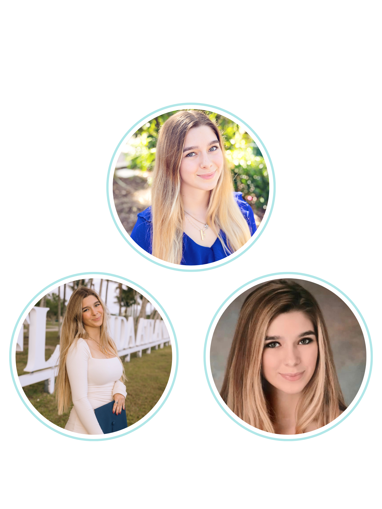

  <h1 style="font-family: 'Comic Sans MS', cursive, sans-serif; color: white; font-size: 50px; text-align: center;">
    Jenna Leali 
  </h1>

  

    Showcasing my abilities in data science and analytics through projects and experiences.
  

  <a href="https://github.com/JennaLeali" style="font-size: 20px; background-color: #FF69B4; color: white; padding: 10px 20px; border-radius: 5px; text-decoration: none; margin-bottom: 30px;">
    View project on GitHub
  </a>

  <!-- Image -->
  

---

  <h2 style="font-family: 'Comic Sans MS', cursive, sans-serif; color: #FF69B4; font-size: 45px; text-align: center; margin-bottom: 40px;">
    Contact Information
  </h2>

  

    <!-- Email -->
    

      <a href="mailto:jallureleali@gmail.com" style="font-size: 20px; background-color: #FF69B4; color: white; padding: 15px 30px; border-radius: 5px; text-decoration: none;">
        Click here to email me
      </a>
    

    <!-- LinkedIn -->
    

      <a href="https://www.linkedin.com/in/jennaleali/" target="_blank" style="font-size: 20px; background-color: #FF69B4; color: white; padding: 15px 30px; border-radius: 5px; text-decoration: none;">
        Click here to see my LinkedIn
      </a>
    

    <!-- GitHub -->
    

      <a href="https://github.com/JennaLeali" target="_blank" style="font-size: 20px; background-color: #FF69B4; color: white; padding: 15px 30px; border-radius: 5px; text-decoration: none;">
        Click here to visit my GitHub
      </a>
    

  
  

---

## Education

{:height="100px" width="100px"}

**Master of Science in Data Science and Analytics, Florida Atlantic University**  
[Link to Degree Requirements](https://www.fau.edu/engineering/eecs/graduate/ms/data-science-and-analytics/courses/)  
Minor in Artificial Intelligence  
[Link to Minor Details](https://www.fau.edu/engineering/eecs/undergraduate/minors/artificial-intelligence/)  
Big Data Analytics Certificate  
[Link to Certificate Details](https://www.fau.edu/engineering/eecs/graduate/certificates/big-data/)   
(Expected graduation: Dec 2024)

**Bachelor of Science in Data Analytics, Florida Atlantic University Harriet L. Wilkes Honors College**  
[Link to Degree Requirements](https://www.fau.edu/honors/academics/majors/data-analytics/)  
Minor in Economics  
Graduated: 2024

---

  <h2 style="font-family: 'Comic Sans MS', cursive, sans-serif; color: #6A5ACD; font-size: 45px; text-align: center;">
    Resume
  </h2>

  

    
    <!-- Left: Resume link -->
    

      <a href="resume.pdf" target="_blank" style="font-size: 20px; background-color: #6A5ACD; color: white; padding: 10px 20px; border-radius: 5px; text-decoration: none;">
        Click here to view my resume
      </a>
    

    <!-- Right: Resume image -->
    

      
    

  
  

---

## Projects
Here are some of the data science and analytics projects I've worked on:

1. **Project 1**: Description for Project 1
2. **Project 2**: Description for Project 2
3. **Project 3**: Description for Project 3
4. **Project 4**: Description for Project 4
5. **Project 5**: Description for Project 5

---

<h2 style="font-family: 'Comic Sans MS', cursive, sans-serif; color: #FF69B4; font-size: 45px; text-align: center;">
  Fun Facts About Me
</h2>

  

    

      

        1. I was a competitive swimmer growing up, participating in year-round, high school, summer league, and national teams.
      

      
    

  

  

    

      

        2. My favorite food is crab legs.
      

      
    

  

  

    

      

        3. I have a Golden Retriever named Murphy.
      

      
    

  

